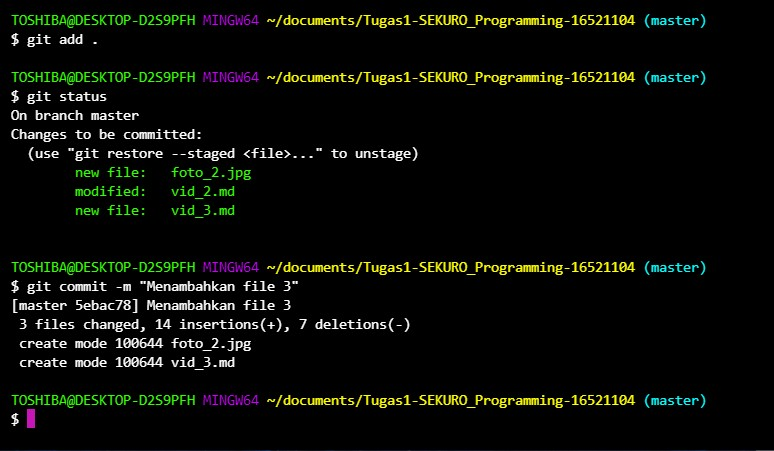

# Rangkuman Video 3 "Github Branch"
* Definisi Branch  
Percabangan selain jalur utama / master     
* Branching  
1.Membuat git branch  
2.Membuat Snapshot tanpa mengganggu jalur utama  
3.Fitur Experiment  
4.2 orang mengerjakan repo yang sama
