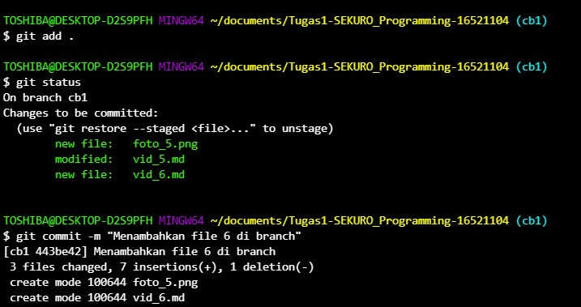

# Rangkuman Video 6 "Git branch dan merge"
* Mulai belajar git secara lokal di komputer kita  
1.membuat repositor dan beberapa stage dalam git   
2.git add,commit,log,checkout  
3.Instalasi git untuk pengguna baru  
